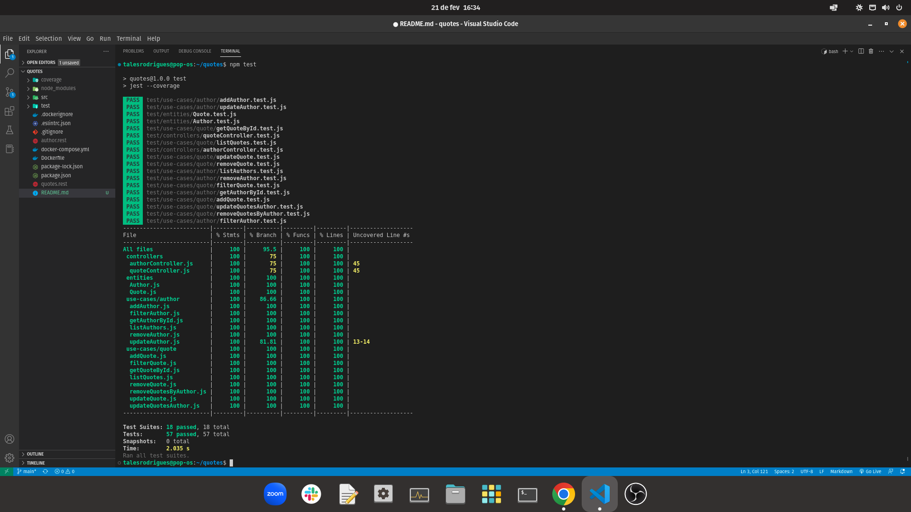

# Quotes API

This project is all about trying to apply Clean Architecture principles. It's a CRUD API about Quotes and Authors.

## Tests



## Setup

```
git clone git@github.com:talesrodriguesDEV/quotes-api.git
cd quotes-api
npm install
docker-compose up
```

## Usage

To make requests to the API you can change the .rest files if you have the REST Client VSCode extension installed.
Otherwise, feel free to use other tools such as Thunder Client and Postman.

The business rules are inside entities and use-cases folders.

## Stacks

1. JavaScript
2. Node.js
3. Jest
4. Docker
5. Express
6. MongoDB
